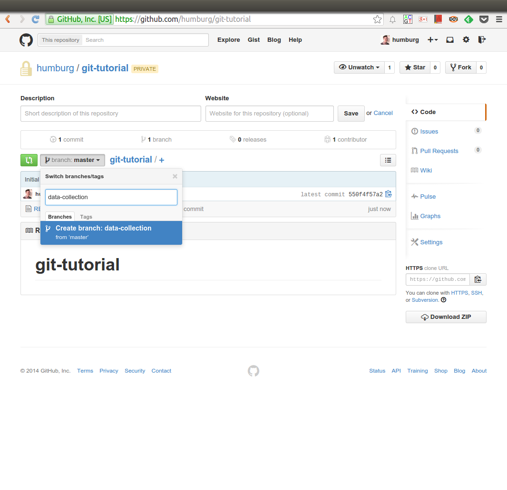
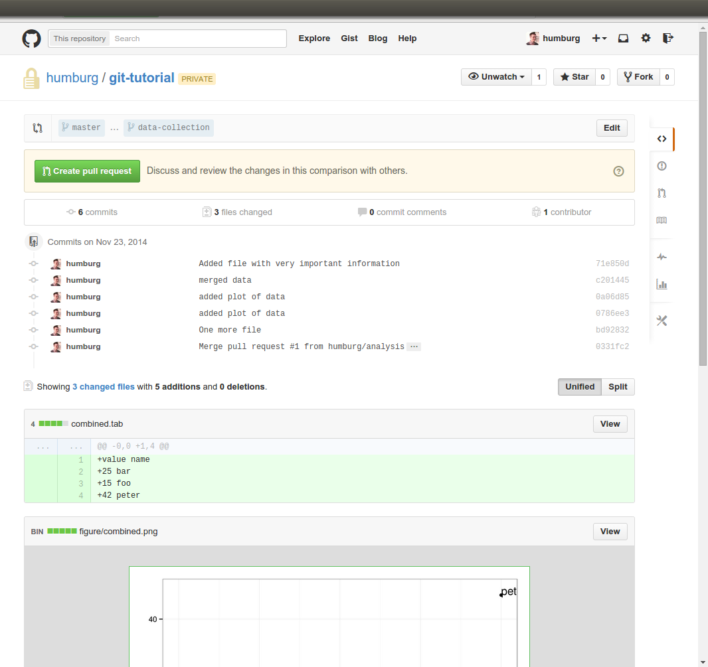
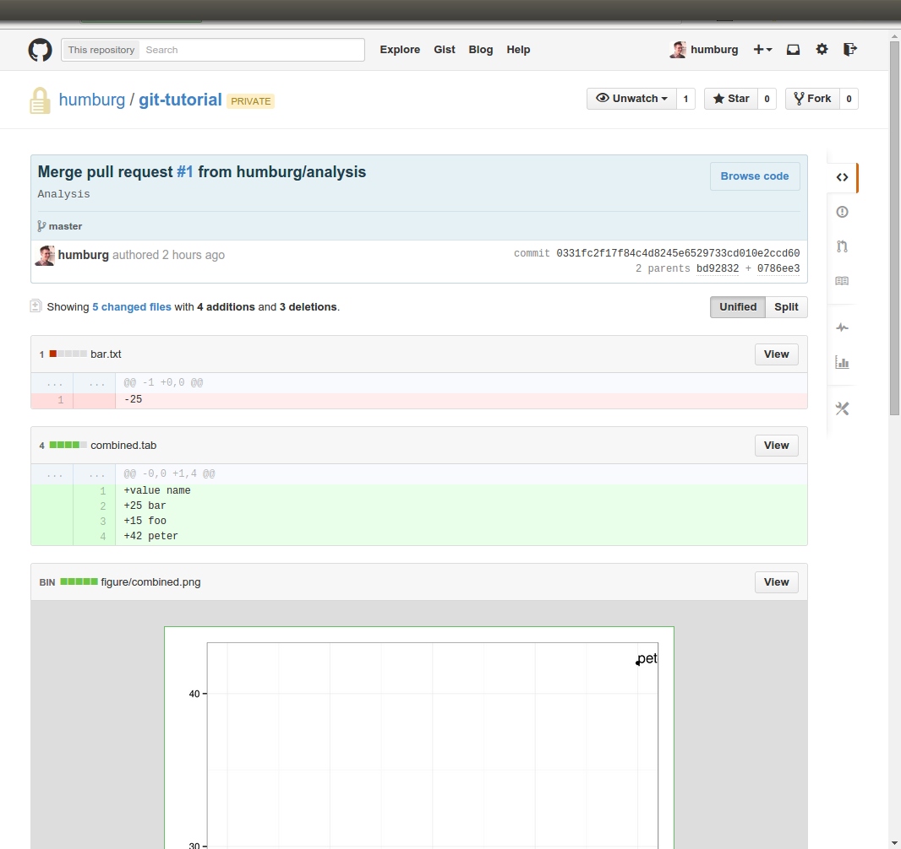

# Git. The what and why. {#git}
## Why use version control?
. . .

* Keeping track of changes
* Collaborate
* Maintain multiple versions
* Understand what happened
* Recover previous versions
* Backup source code

<div class="notes">
* Keeping track of changes
     - Record changes as they happen.
     - Complete version history.
* Collaborate
    - Multiple people can edit the same file without overwriting each others changes.
    - Get an overview of who changed what.
* Maintain multiple versions
    - Branching allows several versions of code to coexist.
    - Can integrate changes from different branches. 
* Understand what happened
    - Each change comes with a (hopefully) useful description.
    - Did something break? Identify the change that caused the problem.
* Recover previous versions
    - Can return to any version.
    - Did something break? Just restore the last working version.
* Backup
    - Repository (on a remote server) can serve as backup for source code.
</div>

## Using Git {data-transition="none"}


## Using Git {data-transition="none"}


## Using Git {data-transition="none"}


## Using Git {data-transition="none"}


## Using branches


* Can maintain several parallel versions.
* Use one branch for the latest stable version (master).
* Other branches for development.
* Changes to one branch will not interfere with use of other branches.
* Different [workflows](#other-git-resources) use branches in variety of ways.

# What is GitHub?
## Cloud storage
GitHub hosts Git repositories.

Great backup for source code and other documents 
(like [this presentation](http://jknightlab.github.io/git-intro/)).

## Web interface
<div class="left">

</div>
<div class="right">
* Manage repositories
    - create/delete repositories and files
    - edit files
* Browse commit history
    - examine changes to files
    - even images!
* Host documentation
    - Wiki
    - Static web page
* Issue tracker
</div>

## Social network


<div class="left">
* Share code, analyses, documents, ...
* Discuss (issue tracker)
</div>
<div class="right">
* Contribute (fork and pull requests)
* Follow other users
</div>

# Using GitHub
## Create a repository


<div class="notes">
Create a new repo on GitHub and call it `git-tutorial`.

Make sure it is initialised with a README.

Quickly show how files (in this case the README) can be edited on the website.
</div>

## Create a new branch


<div class="notes">
Create a new branch called `data-collection`

We will use this to add a few files and process them.
</div>

## Clone it {data-transition="none"}
Two ways to access repositories on GitHub

#. HTTPS
    
    ```{.bash}
    git clone https://github.com/jknightlab/git-tutorial.git
    ```

#. SSH
    
    ```{.bash}
    git clone git@github.com:jknightlab/git-tutorial.git
    ```
    
## Clone it {data-transition="none"}
Two ways to access repositories on GitHub

#. HTTPS
    
    ```{.bash}
    git clone https://github.com/jknightlab/git-tutorial.git
    ```
    
    * No additional setup required
    * Works from behind firewalls/proxies
    * Requires user name and password for every `push`, `pull` or `fetch`
    * Git can do this for you
        
        ```{.bash} 
        git config --global credential.helper 'cache --timeout=36000'
        ```
#. SSH
    
    ```{.bash}
    git clone git@github.com:jknightlab/git-tutorial.git
    ```

<div class="notes">
Should probably use HTTPS for now.
</div>

## Clone it {data-transition="none"}
Two ways to access repositories on GitHub

#. HTTPS
    
    ```{.bash}
    git clone https://github.com/jknightlab/git-tutorial.git
    ```

#. SSH
    
    ```{.bash}
    git clone git@github.com:jknightlab/git-tutorial.git
    ```
    
    * Need to generate and deploy SSH keys
    * If private keys are password protected this has to be entered for each `push`,
      `pull` or `fetch` command.
    * [Can use `ssh-agent` to take care of passwords](#ssh-agent-setup). 

<div class="notes">
Don't forget to change into the newly created directory after cloning.
</div>


## Configure the repository

Tell Git your name and email address. These will be used to attribute 
commits.

```{.bash}
git config --global user.name <your name>
git config --global user.email <your email>
```

. . .

If you are working on Windows also set this option

```{.bash}
git config --global core.autocrlf true
```

<div class="notes">
It is best to get the basic configuration done and out of the way before
launching into any actual work.

Depending on the setup user name and/or email may be populated properly already.

Also make sure Git is converting line endings on Windows (but not on Mac/Linux).
</div>


## Switch branches
Currently we are using the `master` branch.

```{.bash}
git status
```

. . .

List all existing branches

```{.bash}
git branch -a
```

. . .

Switch to `data-collection` branch

```{.bash}
git checkout data-collection
```

<div class="notes">
Could have changed the default branch on GitHub to `data-collection` instead.
</div>

## Add a file
Create a new file (using your favourite text editor).

. . .

We now have an untracked file in our repository.

```{.bash}
git status
```
. . .

Add the file to the staging area

```{.bash}
git add <your file>
```

<div class="notes">
Call the file "<your name>.txt" and store a single number in it.

Run `git status` after each step to see how the file is recognised by Git.
</div>


## Commit and push
Time to commit all staged changes (don't forget to add a descriptive commit message)

```{.bash}
git commit -m "Added file with very important information"
```

. . .

Now we can push the new files to GitHub

```{.bash}
git push
```

<div class="notes">
It is now time to add the new files to our local repository before pushing them to 
GitHub.

Again, use `git status` to see the status change after each step.

After files have been pushed to GitHub, go to the website to see them appear there.
</div>


## Pull
Before doing anything else, make sure your local repository is up to date.

```{.bash}
git pull
```

<div class="notes">
This should distribute the files created earlier to everyone.
</div>


## Playing with the data
Create a new branch (off the `data-collection` branch).

```{.bash}
git checkout -b analysis
```

. . .

Combine all the data (in R) ...

```{.r}
files <- dir(pattern=".txt")
data <- lapply(files, read.table)
data <- do.call(rbind, data)
names(data) <- "value"
names <- lapply(files, strsplit, ".", fixed=TRUE)
data$name <- sapply(names, sapply, "[[", 1)
write.table(data, file="combined.tab", row.names=FALSE)
``` 

. . .

and add it to the repository.

```{.bash}
git add combined.tab
git rm *.txt
git commit -m "Combined data into single file"
```

<div class="notes">
Create a sub-directory and place the R code in a file in it. 
Don't forget to add it to the index.
</div>

## Pushing the new branch to GitHub
When pushing a new branch for the first time we need to tell Git where it should go.

```{.bash}
git push --set-upstream origin analysis
``` 

## More fun with data
Let's plot the data

```{.r}
library(ggplot2)
data <- read.table("combined.tab", header=TRUE)
data$rank <- order(data$value)
ggplot(data, aes(y=value, x=rank)) + geom_point() + theme_bw()
ggsave("figure/combined.png")
```

. . .

and add the plot to the repository.

```{.bash}
git add figure/combined.png
git commit -m "added plot of data"
git push
```
<div class="notes">
Again, the R code should go into file and be added to the repo.

Make sure the output directory for the figure exists.

After pushing the plot back to GitHub it may be a good opportunity to show what 
things look like now.
</div>

## The fun continues
Maybe that plot could be improved?

```{.r}
ggplot(data, aes(y=value, x=rank)) + geom_point() + 
		geom_text(aes(label=name), hjust=0, vjust=0) + 
		theme_bw()
```

. . .

```{.bash}
git add figure/combined.png
git commit -m "Added labels to data points."
git push
```

<div class="notes">
Replace the plotting command in the script created earlier and re-run. 
</div>

## Merging on GitHub
<div class="left">

</div>
<div class="right">
Can merge branches on GitHub (if there are no conflicts).

#. Create pull request for branch that should be merged
#. Approve pull request and merge
#. *Delete merged branch*
</div>

<div class="notes">
Merge `analysis` into `data-collection`.
Make sure to delete `analysis` at the end so that the next slide makes sense.
</div>

## Clean-up

Branches that have been deleted on GitHub still exist in the local repository.
Best to clean them up.

```{.bash}
git pull
git branch --merged | grep -v "\*" | grep -v master | xargs -n 1 git branch -d
git pull --prune
```

<div class="notes">
This identifies all local branches that have been deleted on the remote (i.e. GitHub)
and deletes them. 

The prune command then removes all remote tracking branches that no longer exist. 
</div>

## Local merge
Can always merge locally and then push to GitHub.

Here we merge `data-collection` into `master`
```{.bash}
git checkout master
git merge data-collection
```
. . .

and then delete the local branch and push everything to GitHub

```{.bash}
git branch -d data-collection
git push
```

. . .

Finally, delete the remote branch as well.

```{.bash}
git push origin --delete data-collection
```


## History and diffs
<div class="left">

</div>
<div class="right">
GitHub provides many ways to explore the history of a project.

#. Network graph
#. View all changes made by a commit
#. View history of individual files
#. See who made changes to a file
</div>

<div class="notes">
Illustrate these on GitHub. Start with the network graph 
(should have come up earlier anyway).

Click on a node in the graph to get details of the commit.

Look at the history of a file, compare two commits to see the changes.

Make sure to show the image diff:

#. Find the commit SHA for the first version of the plot and copy it.
#. Go to the compare view for the repository and set the base to the SHA.
</div>

# Summary
## Common Git commands
`git clone`
  ~ Create a copy of a remote repository.
  
`git add`
  ~ Stage new or changed files for the next commit.
  
`git commit`
  ~ Commit a change set to the local repository.
  
`git push`
  ~ Push committed changes to the remote repository.
 
`git pull`
  ~ Get latest version of files from remote repository and merge them with the local copies.
  
`git status`
  ~ Show status of files in working directory relative to index.

## Managing branches
`git branch`
  ~ Create a new branch or list existing branches. Can also delete local or remote branches 
    (<span class="alert">may want to merge into another branch first</span>).
  
`git checkout`
  ~ Switch to a different branch.

`git merge`
  ~ Merge two branches.
  
## More Git commands
`git rm`
  ~ Delete files from index and working directory.
  
`git reset`
  ~ Reset index and working directory to a previous commit.
  
`git stash`
  ~ Temporarily undo changes that you don't want to commit immediately.
  
  
# Useful resources
## Git and GitHub tutorials
* GitHub for Beginners [part 1](http://readwrite.com/2013/09/30/understanding-github-a-journey-for-beginners-part-1) and [part 2](http://readwrite.com/2013/10/02/github-for-beginners-part-2)
* [Git: Your new best friend](http://www.sitepoint.com/version-control-git/)
* [Git for Scientists](http://nyuccl.org/pages/GitTutorial/)
* [Interactive online tutorial](https://try.github.io/levels/1/challenges/1)
* GitHub [bootcamp](https://help.github.com/categories/bootcamp/)
* [Tutorials from Atlassian](https://www.atlassian.com/git/tutorials/)

## Other Git resources
* [Git documentation](http://git-scm.com/) including [installation instructions](http://git-scm.com/book/en/v2/Getting-Started-Installing-Git)
* GitHub GUI for [Windows](https://windows.github.com/) and [Mac](https://mac.github.com/)
* [GitHub workflow](https://guides.github.com/introduction/flow/index.html) explained.
* Comparison of Git [workflows](https://www.atlassian.com/git/tutorials/comparing-workflows).
* Detailed description of Git [configuration](http://git-scm.com/book/zh/v2/Customizing-Git-Git-Configuration).

# Appendix
## Setting up ssh agent {#ssh-agent-setup}
If working on a Linux machine that isn't automatically starting an ssh-agent instance
this can be achieved by adding the following code to `.profile`

```{.bash}
SSH_ENV="$HOME/.ssh/environment"

function start_agent {
    echo "Initialising new SSH agent..."
    /usr/bin/ssh-agent -s | sed 's/^echo/#echo/' > "${SSH_ENV}"
    echo succeeded
    chmod 600 "${SSH_ENV}"
    . "${SSH_ENV}" > /dev/null
    /usr/bin/ssh-add;
}

# Source SSH settings, if applicable

if [ -f "${SSH_ENV}" ]; then
    . "${SSH_ENV}" > /dev/null
    ps -ef | grep ${SSH_AGENT_PID} | grep "$(whoami).*ssh-agent\s" > /dev/null || {
        start_agent;
    }
else
    start_agent;
fi
```

The ssh passphrase then only needs to be entered once when the ssh agent is started.