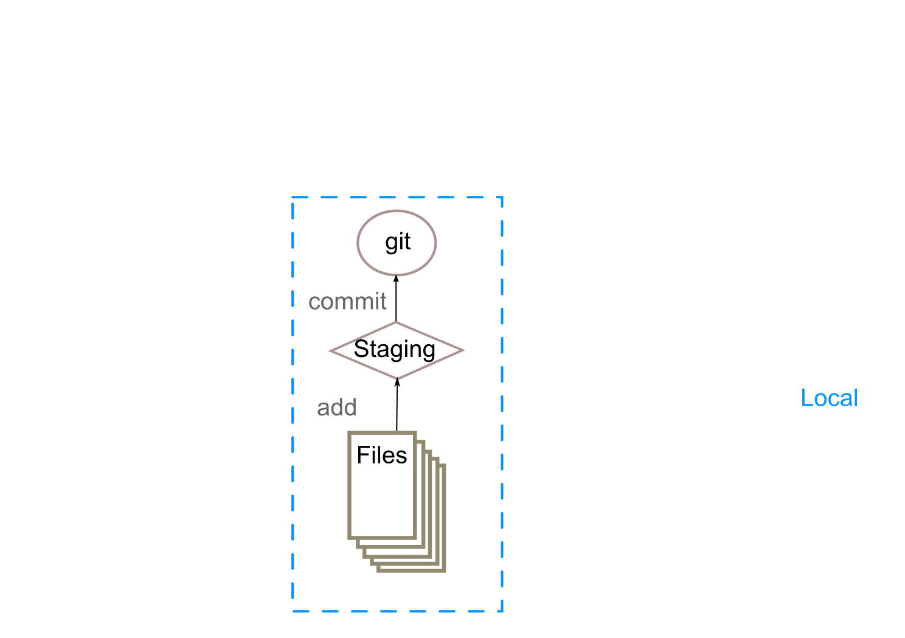

# Git. The what and why. {#git}
## Why use version control?
. . .

* Keeping track of changes
* Collaborate
* Maintain multiple versions
* Understand what happened
* Recover previous versions
* Backup source code

<div class="notes">
* Keeping track of changes
     - Record changes as they happen.
     - Complete version history.
* Collaborate
    - Multiple people can edit the same file without overwriting each others changes.
    - Get an overview of who changed what.
* Maintain multiple versions
    - Branching allows several versions of code to coexist.
    - Can integrate changes from different branches. 
* Understand what happened
    - Each change comes with a (hopefully) useful description.
    - Did something break? Identify the change that caused the problem.
* Recover previous versions
    - Can return to any version.
    - Did something break? Just restore the last working version.
* Backup
    - Repository (on a remote server) can serve as backup for source code.
</div>

## Using git {data-transition="none"}


## Using git {data-transition="none"}


## Using git {data-transition="none"}


## Using git {data-transition="none"}


## Using branches


* Can maintain several parallel versions.
* Use one branch for the latest stable version (master).
* Other branches for development.
* Changes to one branch will not interfere with use of other branches.
* Different [workflows](#other-git-resources) use branches in variety of ways.

# What is GitHub?
## Cloud storage
GitHub hosts git repositories.

Great backup for source code and other documents.

## Web interface
<div class="left">

</div>
<div class="right">
* Manage repositories
    - create/delete repositories and files
    - edit files
* Browse commit history
    - examine changes to files
    - even images!
* Host documentation
    - Wiki
    - Static web page
* Issue tracker
</div>

## Social network


<div class="left">
* Share code, analyses, documents, ...
* Discuss (issue tracker)
</div>
<div class="right">
* Contribute (fork and pull requests)
* Follow other users
</div>

# Using GitHub
## Create a repository


## Create a new branch

## Clone it {data-transition="none"}
Two ways to access repositories on GitHub

#. HTTPS
    
    ```{.bash}
    git clone https://github.com/jknightlab/git-tutorial.git
    ```

#. SSH
    
    ```{.bash}
    git clone git@github.com:jknightlab/git-tutorial.git
    ```
    
## Clone it {data-transition="none"}
Two ways to access repositories on GitHub

#. HTTPS
    
    ```{.bash}
    git clone https://github.com/jknightlab/git-tutorial.git
    ```
    
    * No additional setup required
    * Works from behind firewalls/proxies
    * Requires user name and password for every `push`, `pull` or `fetch`
    * Git can do this for you
        
        ```{.bash} 
        git config --global credential.helper cache
        ```
#. SSH
    
    ```{.bash}
    git clone git@github.com:jknightlab/git-tutorial.git
    ```
    
## Clone it {data-transition="none"}
Two ways to access repositories on GitHub

#. HTTPS
    
    ```{.bash}
    git clone https://github.com/jknightlab/git-tutorial.git
    ```

#. SSH
    
    ```{.bash}
    git clone git@github.com:jknightlab/git-tutorial.git
    ```
    
    * Need to generate and deploy SSH keys
    * If private keys are password protected this has to be entered for each `push`,
      `pull` or `fetch` command.
    * [Can use `ssh-agent` to take care of passwords](#ssh-agent-setup). 

## Switch branches

## Add a file

## Commit and push

## Pull

## Playing with the data

## Merging

## History and diffs

# Summary
## Common git commands
`git clone`
  ~ Create a copy of a remote repository.
  
`git add`
  ~ Stage new or changed files for the next commit.
  
`git commit`
  ~ Commit a change set to the local repository.
  
`git push`
  ~ Push committed changes to the remote repository.
 
`git pull`
  ~ Get latest version of files from remote repository and merge them with the local copies.
  
`git status`
  ~ Show status of files in working directory relative to index.

## Managing branches
`git branch`
  ~ Create a new branch or list existing branches. Can also delete local or remote branches 
    (<span class="alert">may want to merge into another branch first</span>).
  
`git checkout`
  ~ Switch to a different branch.

`git merge`
  ~ Merge two branches.
  
## More git commands
`git rm`
  ~ Delete files from index and working directory.
  
`git reset`
  ~ Reset index and working directory to a previous commit.
  
`git stash`
  ~ Temporarily undo changes that you don't want to commit immediately.
  
  
# Useful resources
## Git and GitHub tutorials
* GitHub for Beginners [part 1](http://readwrite.com/2013/09/30/understanding-github-a-journey-for-beginners-part-1) and [part 2](http://readwrite.com/2013/10/02/github-for-beginners-part-2)
* [Git: Your new best friend](http://www.sitepoint.com/version-control-git/)
* [Git for Scientists](http://nyuccl.org/pages/GitTutorial/)
* [Interactive online tutorial](https://try.github.io/levels/1/challenges/1)
* GitHub [bootcamp](https://help.github.com/categories/bootcamp/)
* [Tutorials from Atlassian](https://www.atlassian.com/git/tutorials/)

## Other Git resources
* [Git documentation](http://git-scm.com/) including [installation instructions](http://git-scm.com/book/en/v2/Getting-Started-Installing-Git)
* GitHub GUI for [Windows](https://windows.github.com/) and [Mac](https://mac.github.com/)
* [GitHub workflow](https://guides.github.com/introduction/flow/index.html) explained.
* Comparison of git [workflows](https://www.atlassian.com/git/tutorials/comparing-workflows).

# Appendix
## Setting up ssh agent {#ssh-agent-setup}
If working on a Linux machine that isn't automatically starting an ssh-agent instance
this can be achieved by adding the following code to `.profile`

```{.bash}
SSH_ENV="$HOME/.ssh/environment"

function start_agent {
    echo "Initialising new SSH agent..."
    /usr/bin/ssh-agent -s | sed 's/^echo/#echo/' > "${SSH_ENV}"
    echo succeeded
    chmod 600 "${SSH_ENV}"
    . "${SSH_ENV}" > /dev/null
    /usr/bin/ssh-add;
}

# Source SSH settings, if applicable

if [ -f "${SSH_ENV}" ]; then
    . "${SSH_ENV}" > /dev/null
    ps -ef | grep ${SSH_AGENT_PID} | grep "$(whoami).*ssh-agent\s" > /dev/null || {
        start_agent;
    }
else
    start_agent;
fi
```

The ssh passphrase then only needs to be entered once when the ssh agent is started.